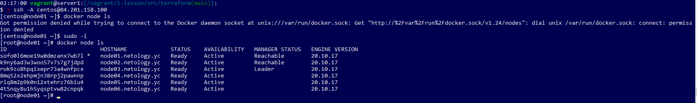
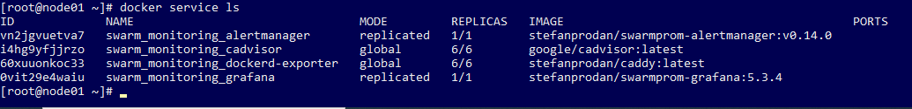
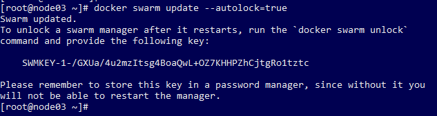

# Домашнее задание к занятию "5.5. Оркестрация кластером Docker контейнеров на примере Docker Swarm"

## Задача 1

Дайте письменые ответы на следующие вопросы:

- В чём отличие режимов работы сервисов в Docker Swarm кластере: replication и global?
  <br>-Replication режим поддерживает заданное кол-во реплик, не зависимо от числа нод. Global же расрастраняет реплики по всем нодам, тем самым сервис становится доступен по адресу любой из нод.
- Какой алгоритм выбора лидера используется в Docker Swarm кластере?
  <br>-
- Что такое Overlay Network?
   <br>- Это сеть для связи между нодами. Связь между нодами происходит по протоколу UDP на порту 4789. 


## Задача 2

Создать ваш первый Docker Swarm кластер в Яндекс.Облаке

Для получения зачета, вам необходимо предоставить скриншот из терминала (консоли), с выводом команды:
```
docker node ls
```
## Ответ <br>

<p align="center">
  
</p>

## Задача 3

Создать ваш первый, готовый к боевой эксплуатации кластер мониторинга, состоящий из стека микросервисов.

Для получения зачета, вам необходимо предоставить скриншот из терминала (консоли), с выводом команды:
```
docker service ls
```
## Ответ <br>

<p align="center">
  
</p>

## Задача 4 (*)

Выполнить на лидере Docker Swarm кластера команду (указанную ниже) и дать письменное описание её функционала, что она делает и зачем она нужна:

 см.документацию: https://docs.docker.com/engine/swarm/swarm_manager_locking/
docker swarm update --autolock=true


## Ответ <br>
Режим при котором блокируется запуск Docker swarm кластера без сгенерированного ключа. 
При запуске команды docker swarm update --autolock=true генерируется ключ, который нужно сохранить, он будет требоваться при каждом запуске кластера пока активирована опция --autolock.
После перезапуска серверов. Придётся делать docker swarm unlock и вводить пароль на каждом сервере кластера.

<p align="center">
  
</p>

```


---
